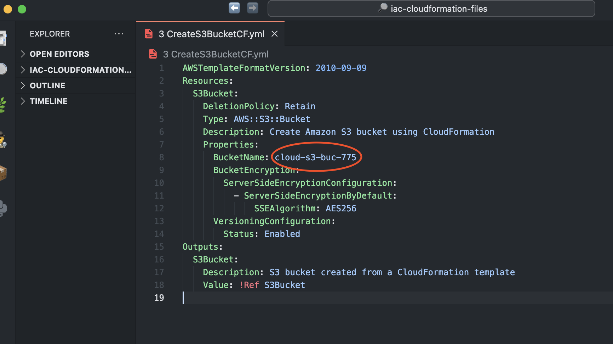
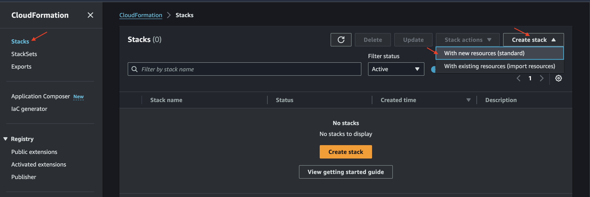
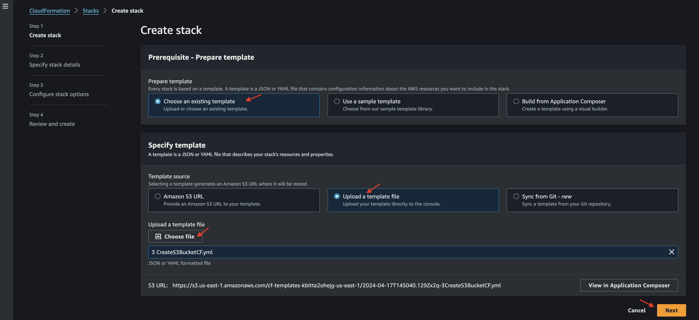
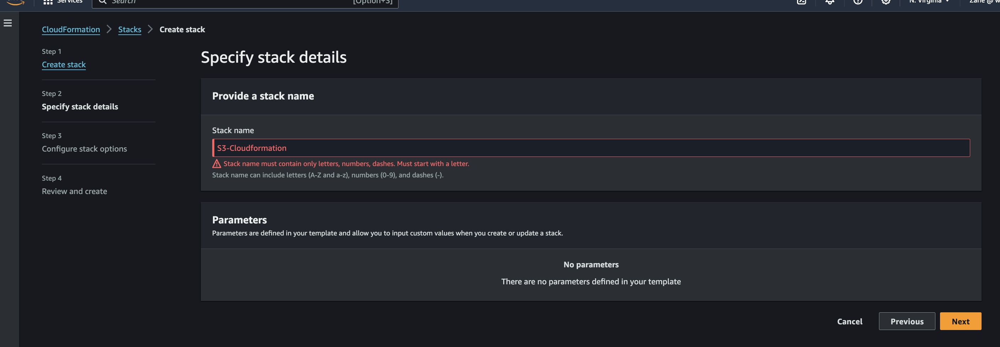
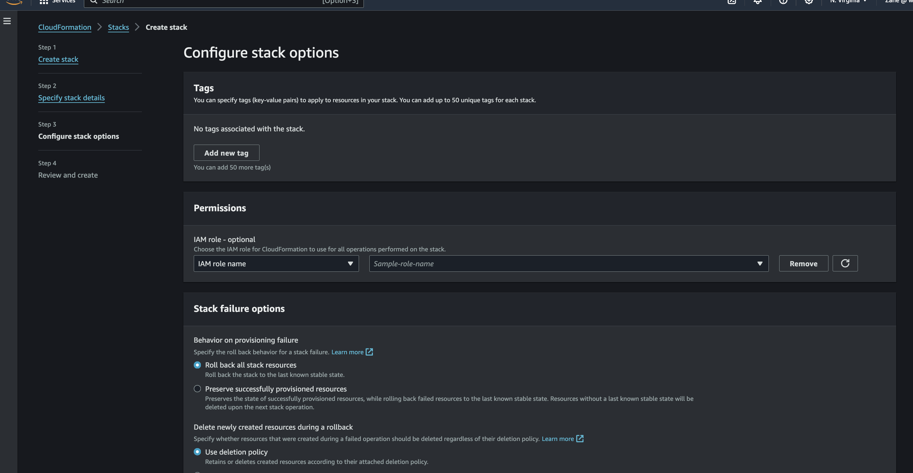
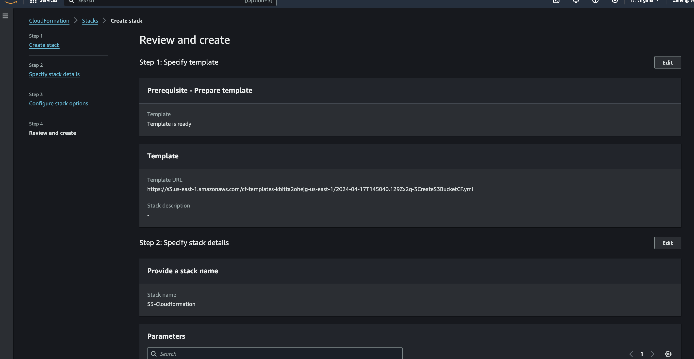
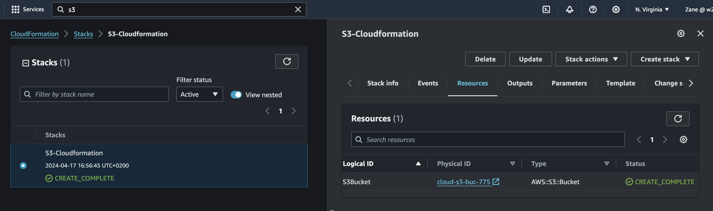
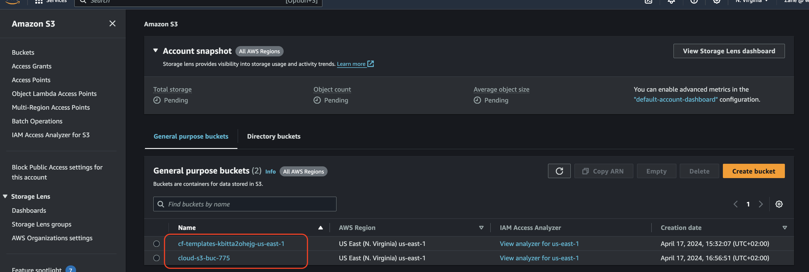
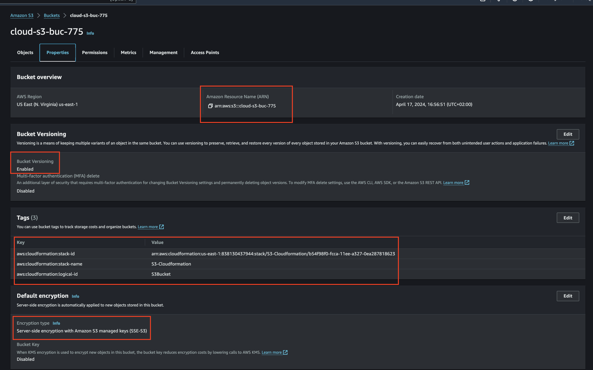

# Deploying Infrastructure as A Code With CloudFormation

__This project utilizes AWS CloudFormation to create an S3 bucket with the following configurations:__

**S3 Bucket:** A Simple Storage Service (S3) bucket is created to store and manage objects within AWS.

**Versioning Enabled:** Versioning is enabled for the S3 bucket. This feature allows for the storage of multiple versions of an object within the bucket.

**S3 Server-Side Encryption:** Server-side encryption is enabled for the S3 bucket, ensuring that all objects stored in the bucket are encrypted at rest.

# Steps:

# 1. Modify Template (Optional): 

Optionally, modify the CloudFormation template to customize parameters such as the bucket name or additional configurations.

# 2. Deploy Stack: 

Use AWS CloudFormation to create and deploy the stack using the provided template. 

Create Stack with new Resources (Standard)

Choose existing template and upload the template provided then select Next.

Enter Stack name

configure Stack options keeping all setting default.

Review and create stack

All few Mintues for creation.

Ensure that you have the necessary permissions and credentials to create resources in AWS.

# 3. Verify Bucket Creation: 

After the stack creation is complete, verify that the S3 bucket has been successfully created with versioning enabled and server-side encryption enabled.

S3 Bucket created by CloudFormation. 

Highlighted are all Created and enable in S3 Bucket.

